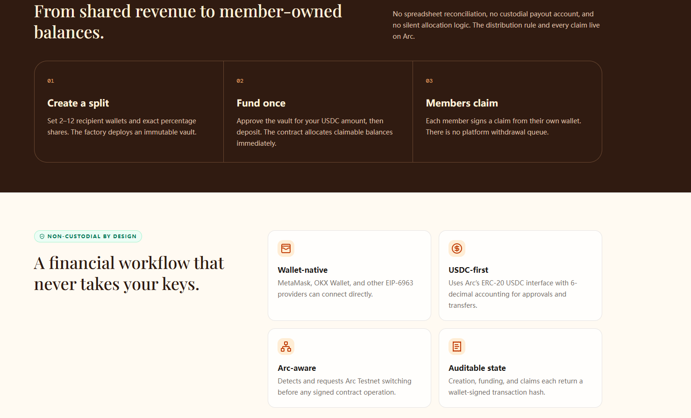

# ArcSplit



ArcSplit is a non-custodial USDC revenue-sharing app built for Arc Testnet. It lets creators, teams, agencies, and communities define immutable payout splits, fund a vault once, and let each recipient claim their share directly from their own wallet.

## What problem it solves

Revenue sharing is often handled manually with spreadsheets, private agreements, and repeated transfers. That workflow is slow, hard to audit, and easy to dispute.

ArcSplit replaces that process with an onchain split-vault model:

- Create a split with recipient wallets and percentage shares
- Fund the vault with USDC
- Record claimable balances onchain
- Let each recipient claim independently

## Core flow

1. Create a split
2. Fund once
3. Members claim

## Product highlights

- Non-custodial by design
- Wallet-native interaction
- Arc Testnet aware
- USDC-first accounting
- Auditable transaction state
- No backend signer
- No platform custody of user funds

## Built for Arc Testnet

ArcSplit is designed specifically for Arc Testnet and uses USDC as the core asset for transparent onchain revenue distribution.

- Network: `Arc Testnet`
- Chain ID: `5042002`
- RPC: `https://rpc.testnet.arc.network`
- Explorer: `https://testnet.arcscan.app`
- ERC-20 USDC: `0x3600000000000000000000000000000000000000`

## Deployed on Arc Testnet

- Deployer: `0x3edc2338c5a6ce3b03bd9d366cfac9f63f76d2ef`
- Project contract: `0x7181198ee7c390D2eCC9B7d856A0ACB12Bcf2746`

## Architecture

ArcSplit uses a Factory + Vault model:

- `ArcSplitFactory` deploys a dedicated vault for each split configuration
- Each vault stores recipients, allocation shares, deposits, and claimable balances
- Recipients claim through pull payments from their own wallets
- No owner withdrawal flow
- No post-deployment edits to recipient or share rules

## Repository layout

```text
contracts/              Solidity contracts and deployment scripts
public/                 Static public assets
src/                    React + TypeScript frontend
.env.example            Frontend environment template
index.html              Vite entry HTML
package.json            Frontend package configuration
PROJECT_SUMMARY.md      Short project overview
README.md               Project documentation
vite.config.ts          Vite configuration
